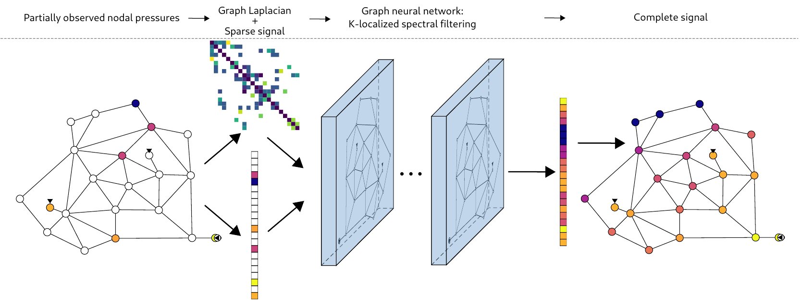

# GraphConvWat -- Graph Convolution on Water Networks
GitHub repository for the paper: "Reconstructing nodal pressure in water distribution systems with graph neural networks". (under submission, preprint available at arXiv: [https://arxiv.org/abs/2104.13619](https://arxiv.org/abs/2104.13619))

## Repo structure
```
.
├── data                    - dir for data generated by generate_dta.py
├── evaluation              - scripts for evaluating and plotting the results
├── experiments             - parameters for datagen, trained model weights, etc.
├── model                   - graph neural network topologies
├── utils                   - auxiliary classes and scripts &  pip reqs.
├── water_networks          - water network topologies in EPANET-compatible format
├── generate_dta.py         - multithread scene generation
├── hyperopt.py             - hyperparameter optimization
├── LICENSE
├── README.md
├── test_Taylor_metrics.py  - calculating metrics for Taylor-diagrams
└── train.py                - training of GraphConvWat
```

## Citing
### ...the preprint
```
@misc{Hajgato2021,
  author        = {Hajgat{\'{o}}, Gergely and Gyires-T{\'{o}}th, B{\'{a}}lint and Pa{\'{a}}l, Gy{\"{o}}rgy},
  title         = {Reconstructing nodal pressures in water distribution systems with graph neural networks},
  year          = {2021},
  month         = apr,
  archiveprefix = {arXiv},
  eprint        = {2104.13619},
}
```

### ...the repository
```
@misc{graphconvwat,
  author        = {Hajgat{\'{o}}, Gergely and Gyires-T{\'{o}}th, B{\'{a}}lint and Pa{\'{a}}l, Gy{\"{o}}rgy},
  title         = {{GraphConvWat}},
  year          = {2021},
  publisher     = {GitHub}
  journal       = {GitHub repository},
  organization  = {SmartLab, Budapest University of Technology and Economics},
  howpublished  = {\url{https://github.com/BME-SmartLab/GraphConvWat}},
}
```
